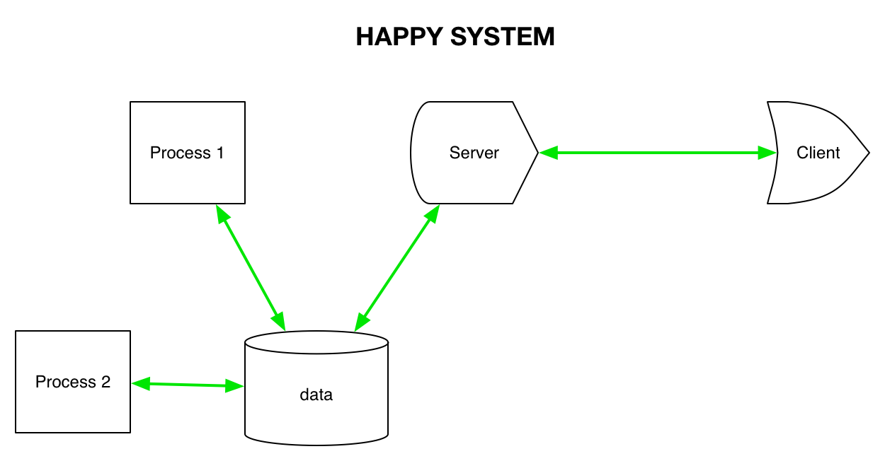
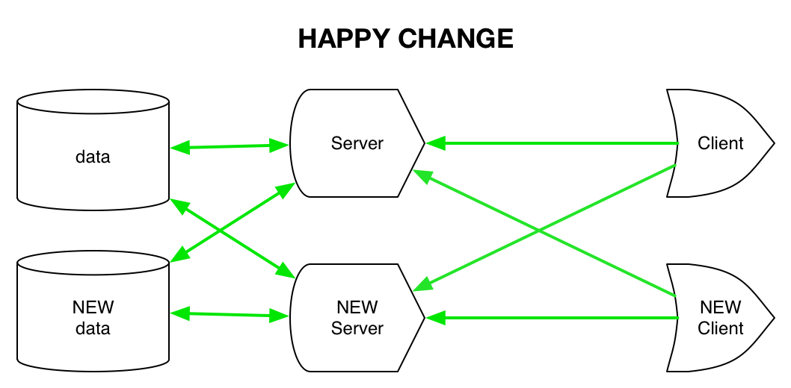
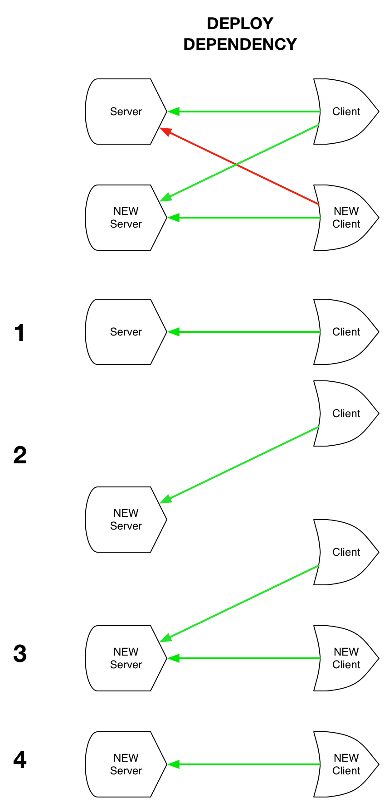
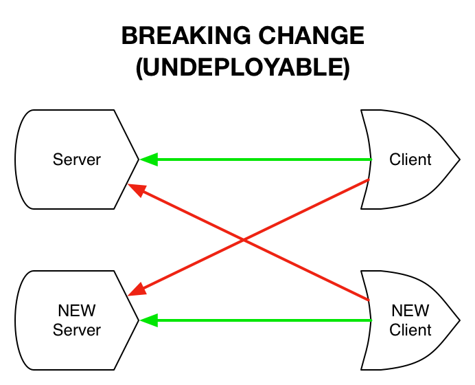
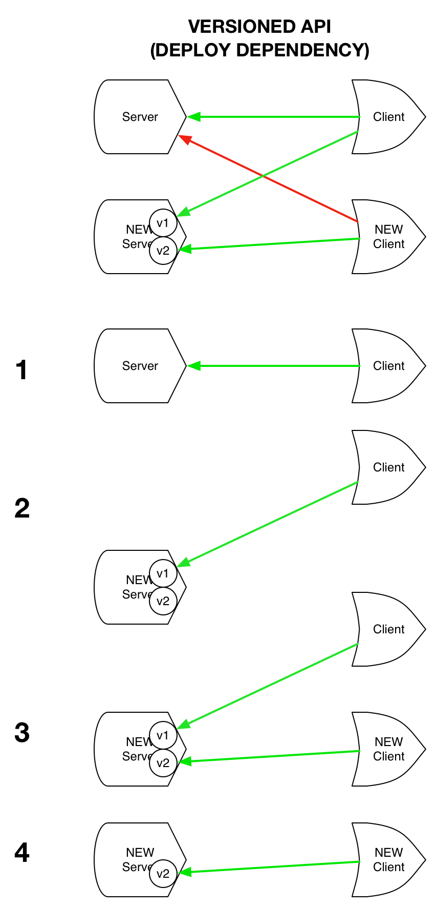
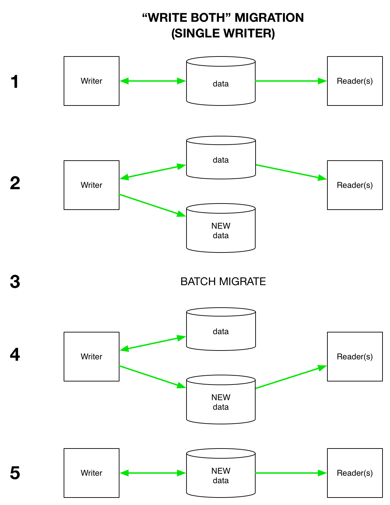
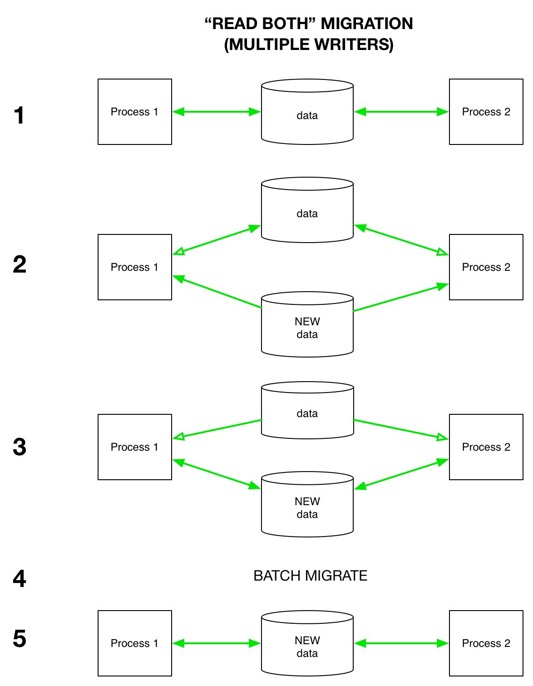

# Migrations and Future Proofing

You've implemented a new feature, which involved refactoring some existing data formats or server handlers.  Everything looks good, the tests all pass, and (if applicable) the latest clients (frontend and/or backend) all seem to work with the latest servers.  Ship it?!

Not so fast.  

If your changes involve formatting changes to **data at rest**, and/or interface changes to servers with **clients running in other processes**, you also have to worry about (and test) how your changes will interact with **old data or code**.

This document first talks about the issues (**inertia**), how to deal them when they come up (**migrations**), and then leads into a discussion of best practices (**forward compatibility**) to reduce the need for or difficulty of future migrations.  

## Examples

Not all code has inertia.  For example, consider a one-off script that you run on your laptop.  The code is self-contained, has no other processes relying on it, and can effectively be changed and rerun at any time.

At Prismatic, we run dozens of highly availabile services in the cloud, process and store millions of documents every day, and regularly ship client apps to customers' iOS and Android devices.  Here are some hypothetical situations illustrating how inertia of code and data can manifest in practice in this more complex environment:

 - We developed a new feature, which required a small change to the data returned by an handler in our API server. Compatibility was tested against the latest version of our iOS app, after which the change was deployed to production.  Immediately, 5% of our users' iOS apps crashed, because they turned off auto-update and are still on version 1.0, which turned out to be incompatible with the modified API handler. 
 - We have many terabytes of documents in a data store, which we both write to and read from in production.  A migration job is started to add a new field to each document, and the existing production code starts crashing when it sees documents with the new field.  It seems like any step in the right direction (migrate the data, deploy code that expects the new field) will fail; at the same time, we also don't want to resort to scheduled downtime to do the migration.
    
Later, we describe concrete recipes for dealing with these and related problems without downtime.  

# Inertia (why do we have to deal with old stuff?) 

## Old code 

Since code in a single process is deployed atomically, breaking changes localized to code running in a single process are typically safe.  But when we change APIs that cross process boundaries (such as updating the interface for an API handler), we have to think about the transitional period where both old and new code is running at the same time.  

In the worst case, some of the old code is not under our control.  We have external clients for our APIs, which could range from a web app (possible to force-refresh) to an iOS app (possible to ship updates) to third-party API clients (not our code).  In the latter two cases, we have no explicit control over when old code is replaced with new, and might have to support old API clients for months or years after we might wish they were dead and gone.  

Moreover, even in the best case where all affected code is running under our control (e.g., on EC2), it's often impossible (or at least unwise) to update all affected processes **simultaneously** (as we'll discuss shortly).  Thus, we typically still have to think about the interaction of old and new code even in this "best" case scenario.

## Old data 

Old data is in some ways better, and many ways worse, than old code.  On the upside, at least the data is typically under our control; we can choose to rewrite it at any time.  Downsides are:

 - Sometimes the data is not actually under our control.  For example, consider urls linked from emails we have sent, or (to a lesser extent) data stored on iOS clients we control. 
 - Data can be **big**; it might take hours or days to migrate a data store from an old format to a new format, and we probably want our application to continue working throughout the migration process.
 - Data often must be **consistent** -- we often want all code (old and new) interacting with a given piece of data to reflect the latest value at a given point (including updates made while the migration is ongoing).  For example, if a user adds a comment to a document after the document has been migrated to a new format with new keys, it's not acceptable for processes during or after the migration to fail to report the new comment.
 - Data is **dumb** -- we can try to make our new code smart about interacting with old code, but there's often no parallel to this for our new data formats. 
 

## Simultaneity and backwards compatibility

If we could simultaneously replace all our old code with new code, and (as applicable) upgrade all our old data to a new format, we'd be happy campers (and this document would be much shorter).  Unfortunately, this is typically impossible, and even when it's possible it's often unwise.  

 - If we introduce incompatibilities with code or data that's not under our control (e.g., old iOS app versions), it's obviously impossible to ensure simultaneity.
 - If we introduce incompatibilities of code with large datasets, it's probably impossible to update the code and migrate all the data simultaneously without downtime.
 - Even if there is no data involved and all the code is under our control, we probably can't redeploy *everything* simultaneously without downtime (unless we're willing to bring up a new copy of the entire system and then move people over).  
 - Even if in principle we can update all the code (and data) simultaneously, if something goes wrong it may be very difficult to  **roll back** a big bang release, especially when data format changes are involved. 
 
When we cannot update all our code (and data) simultaneously, we have to ensure a *deployment strategy* that provides a **path of backwards compatibility**.  This is a sequence of steps, where at each step all running code is able to interoperate with the other code and data visible at this step.  

This example shows a simple system, where we have two processes that read and write from a data store. There is a server that reads and writes to the same datastore and provides an API for clients (e.g, our iOS app).  In this case the system is "happy", since all all communication links are compatible (indicated by green links).  Conceptually, our deployment strategy must ensure that at every step the entire system stays "happy" in this way.

The next section describes recipes for such deployment strategies.

# Migrations (scenarios and strategies)

This section covers various scenarios and strategies for providing a path of backwards compatibility, in roughly increasing order of difficulty.  

## Full forwards and backwards compatibility

The best-case scenario is full compatibility.  All old code can interact with all new code and data, and all new code can interact with all old code and data out there.  

In this happy scenario, new code can be deployed at any time, in any order.  Achieving this result often requires careful forethought (and sometimes incurs an accumulation of cruft, which can often only be removed by breaking changes).  A common significant change that can sometimes be carried out with full compatibility is the addition or removal of new optional keys/columns; this works when old code is sufficiently flexible to handle the new data as-is.  More on this in the next section on forward compatibility.

## Breaking code changes (no data changes)

As mentioned above, breaking changes to code are typically easier to deal with than breaking changes to data formats.  

### Deploy dependencies (additions only)

If your change only involves adding new methods to an API, or a new data format, old clients can often continue to function as-is.  For example, perhaps we add a new handler to our API to support of a new feature in our iOS app.  In this case, the typical complication is the introduction of a **deploy dependency** -- the server with the new APIs (or producer of the new data) must be deployed before all consumers of the new APIs/data.  The only exception is if the consumers are made robustly backwards compatible (able to gracefully handle missing new APIs/data), in which case we're in the previous happy situation.  

The basic steps in this deployment strategy are are:

1. The initial situation, with old server and client
2. The new server(s) are deployed, which are backwards-compatible with the old client
3. The new client(s) are deployed, which can rely on the functionality in the new server
4. (optional) At some later point, the old client is fully replaced by the new

Deploy dependencies are relatively harmless, but should be handled carefully to ensure that the new code is not deployed in the wrong order.  Whenever possible, server and client changes should be made in separate changesets, loudly *declared* in pull requests, and the client change should only be merged to a production branch *after* the server change has been merged and fully deployed.  

As we'll discuss in the final section, extensions to existing methods (such as the addition of new fields to responses) can often be handled in this setup if clients are carefully designed to be forward-compatible with such changes.  
 

### API versioning (breaking code changes)

Suppose we have an existing API method `/interests` that returns a list of `String`s to describe a user's interests.  A new feature of the iOS app requires more information about each interest, so we want to change this to a list of maps like `{'name':foo, ...}`.  Breaking changes like this introduce fatal cycles into the "deploy dependency graph", since new clients need new server APIs and old clients need old APIs, but all the old code can't usually be replaced simultaneously.  

Assuming there are no changes to data at rest, these changes can be converted into the happier "additions only" scenario above by using **API versioning**, (e.g., adding a new method `v2/interests` rather than making breaking changes to `v1/interests`).   

The deployment strategy here is the same as in the previous section:

1. The initial situation, with old server and client
2. The new server is deployed, with the old endpoint preserved for the old client and a new endpoint for the new client
3. The new client is deployed, which uses the new endpoint
4. (optional) At some later point, the old client is fully replaced and the old endpoint can be removed from the server.

The cost of API versioning is that until (4) you have two API methods that do similar things, and they must both be maintained and tested until all code that access the old one is gone and it can be deleted.  Maintenance is further complicated if both methods interact with common data that must be kept in sync, especially when the new method needs to store data not representable in the new format.

## Breaking data format changes 

As described in the previous section, backwards-incompatible data changes are more complex since data cannot typically be updated atomically the way code can; because data is both **big** and **dumb**, it may take a long time to migrate, and it typically can't smartly present itself to old code in a way that papers over the incompatibilities.  

*Note that this document primarily describes general approaches applicable to any data storage technology; for sufficiently "smart" systems (such as SQL) other approaches may be applicable, which we only touch on briefly here.*

### Aside: data versioning

As with APIs, overcoming breaking data format changes typically require **versioning** (or downtime).  There are at least two ways to version data:

1. **In-place:** store a version number inside each datum (or otherwise infer the version from the data), and as you upgrade overwrite the old datum (backing it up if desired).  Adapting the above example to data-at-rest, we might have a single storage location `interests` that stores a mapping from `user-id` to **either** `{:version "1" :data ["cats" "dogs"]}` or `{:version "2" :data [{:name "cats" ...} {:name "dogs" ...}]}`.
2. **Multi-place:** store data in a versioned location, so that new versions can live alongside old versions.  Using the same example, we might have one location `interests_1` that maps `user-id` to `["cats" "dogs"]` and a new location `interests_2` that maps `user-id` to `[{:name "cats" ...} {:name "dogs" ...}]`.

The advantage of in-place versioning is that there's a single location to find the latest version of a datum.  This can make it much easier to ensure data consistency between processes (as we'll see in a second), especially when there are multiple concurrent writers that need transactional semantics.  However, the disadvantage is that during deployment you must ensure that all running code can read all data versions currently in play.

Multi-place versioning can be simpler because each process can read data in a single format, by just choosing the appropriate location to read from.  However, now the onus is on the programmer to ensure consistency requirements are met across all versions of a datum in play.  When consistency requirements are lax (e.g., write-once data), this approach can be much simpler, and also has a much easier story for supporting old code and rolling back as needed.

As we will see, zero-downtime approaches to data migration typically involve either **pausing writes**, or deploying code that can **simultaneously read *or* write both versions** of data for the duration of the migration.  

### Migrating static data (no writers)

Things are simple if the data being migrated is static (or writes can be avoided or deferred during the migration).  In this case, the steps to migrate are:

1. The data is migrated in the background to the new format (multi-place versioning must be used to avoid breaking existing readers)
2. Readers are deployed to read the new format from location 
3. (optional) The old data can be deleted, and writes can resume on the new data
 
This is effectively a simplified version of the "Write Both" migration in the next subsection.  To migrate in-place, there is also a simplified version of the "Read Both" migration below that works when writes are paused.

### "Write Both" migrations (often best for single writer)

Things become significantly more complicated when you need to accommodate writes to your data during the migration process, because you have to ensure that writes during the migration are all captured in the new format by the end of the migration.  

If there is at most a single writer (per datum), the simplest option is often the "Write Both" migration with multi-place versioning.  

For example, when a new user signs up for Prismatic with a Twitter account, within seconds a worker process fetches the user's tweets, analyzes all shared URLs, and stores suggested topics in S3 for presentation later in the onboarding process.  While we have multiple workers computing topic suggestions, the data is effectively write-once with no concurrency concerns, so a "Write Both" migration was appropriate when we wanted to make breaking changes to the suggestions data format.

In this deployment strategy, the writer propagates changes to both the new and old formats throughout the duration of the migration:  

1. The initial situation, with one read/write process and any number of additional readers interacting with the old data
2. The writer is deployed with code that continues to read from the old location, but writes to **both** the old location as well as a new location in the new format 
3. The data is batch migrated from the old to new format.  Note that the batch migration process is technically an additional writer that must be properly synchronized with other writer(s) to avoid losing their concurrent updates.  This can sometimes be simplified by running the migration **inside** the writer (which could be combined with step (2) in a single deploy).  
4. Readers are deployed to read from the new location
5. The writer is deployed to read and write only from the new location, and old data can be archived

The primary advantages of this approach are:

 - Readers only need to be deployed once, and the writer only needs to be deployed twice
 - Readers do not need to be concerned with multiple versions of data, and it's always clear where to find the latest version of a datum
 - Readers can be updated incrementally -- if you have many different clients for your data, you can take as long as you want to move them all over to the new format in step (4) -- and each reader only needs to be updated and deployed once
 
However, there are several disadvantages that are alleviated by the more complex "Read Latest" migration described next:

 - The new format cannot be used to store new information not representable in the old format until all old data is migrated and the migration is completed in step (5).  
 - Multi-place versioning must be used, which requires twice as much storage and write bandwidth during the migration
 - It can be difficult to adapt this approach to multiple concurrent writers, because unless all writers are deployed concurrently in step (5) data loss can ensue (new writer 1 writes a new datum to the new format only, while old writer 2 is still reading from the old format)
 - Even with a single writer, it can be difficult to properly synchronize the writer and batch migration job across the two data locations to avoid concurrency issues
 
#### Variations: SQL databases and transaction logs

That said, there are some common variations of the "Write Both" approach for multiple writers that can work well for "sufficiently smart" data, such as a SQL database.  For instance, several systems ([1](https://github.com/soundcloud/lhm),[2](https://www.facebook.com/note.php?note_id=430801045932),[3](http://openarkkit.googlecode.com/svn/trunk/openarkkit/doc/html/oak-online-alter-table.html)) use *triggers* to propagate updates to the old format to the new format during a migration.  [Others](https://github.com/freels/table_migrator) rely instead on an indexed `updated_at` timestamp column to find rows that still need to be migrated.

Similar schemes can be concocted to work with any system that maintains an explicit write log, since the latest state of the new data can always be reconstructed from the write log.

 
### "Read Latest" migrations

The "Read Latest" migration is more complex than "Write Both".  In exchange for this complexity, it easily accommodates multiple writers, in-place migrations, and the storage of new information in the new format before (or without) a batch migration of old data.  

For example, we have many terabytes of old documents stored at Prismatic, and at any time any document could be retrieved (or modified) by any user visiting their profile page (and potentially doing a new action).  When we've made breaking changes to the format, we've done a "Read Latest" migration to ensure safety in the face of concurrent writes. 

The basic idea here is that rather than trying to keep both new and old formats up-to-date at all times, we ensure that readers are able to find and access the latest version of a datum at any point, whether it be old or new:  

1. The initial situation, with any number of readers and writers interacting with the old data.
2. In any order: 
   - All readers are deployed with the ability to read both the new and old formats.  If the new data will be stored in a new location, readers should always check the new location first, and only fall back to the old if the new version is not yet present (note potential concurrency issue, which can be avoided by using in-place versioning).  
   - All writers are deployed with the same reading behavior, where they write data back *in the format / location it was read in*.  
3. Writers can be deployed to *upgrade on write* to the new version.
4. (optional) The data is batch migrated from the old to new format
5. (optional) Cleanup of old data and code for interacting with the old data format

The primary advantages of this approach are:
 
 - The migration can be done with in-place versioning, which works fine with multiple writers (without adding any additional concurrency concerns) 
 - New information can be stored in the new format starting at (3), before old data is batch migrated  
 - The batch migration can be put off indefinitely, so long as a code path for lazy migration of all old datums is maintained
 
The disadvantages are:
 
 - More total deployments are needed to fully move through the process (three deployments for writers and two for readers).  Note that if the last two steps are skipped, the deploy count is actually the same as "Write Both".
 - Readers need to be concerned with handling both formats.  In principle, this could involve a lot of forked code paths for handling old and new data.  In practice, this can typically be done simply by always using a "new" in-memory representation, upgrading datums on read, and downgrading on write as necessary.

#### Variations: single reader/writer

If only a single process interacts with the data whose format is changing, a much simpler version of the "Read Latest" migration can be used where steps 2 and 3 are combined into a single deploy that lazily migrates the data to the new format (data is always upgraded on read, and written in the new format).  

# Pay it forward

Ensuring **forward compatibility** means writing code that will accommodate future changes to data and clients with a minimum of backwards incompatibilities.  This is very difficult because doing it perfectly involves predicting the future.  However, there are a variety of things we can do to make it less likely that we'll fall into the more difficult situations described above.

## Don't be rash

When you introduce a new API endpoint or format for data at rest, think hard.  These decisions should generally be taken much more seriously than API or data decisions that won't leave a single process.  You may end up with terabytes of data stored in this format, or stubborn users who refuse to update their two-year-old iOS client that accesses your API, and be stuck with this decision for a long time.  Think it through, bounce it off a co-worker or two, and imagine yourself two years in the future working through the worst options in the previous section before committing. 

If you can test a new feature on the web (where you have to support old clients for a day), that's probably preferable to supporting your API for a year on iOS.  If testing on iOS is the best option, try to design the client code such that it degrades gracefully if you remove the server-side API so you're not stuck with it.  If you're designing an experimental server-side feature, see if you can store the data off to the side (e.g., in a different location, rather than together with currently critical data) so you can just delete it if the experiment fails rather than being saddled with this data forever without a huge migration project.  

## Version up-front 

Most of the migration options above involve versioning of data and APIs.  You'll probably make things simpler if you version up-front.  Provide space to introduce new versions of API methods, and store your data with a version inside or inside a versioned bucket.  

## Constrain access when appropriate

As we've seen above, migrations become increasingly difficult as more processes need to read (and especially write) a given piece of data.  Multiple writers always come with potentially concurrency issues, and these are only made worse when the data format needs to change in the future.  Hiding data behind an API rather than accessing directly from a variety of systems can simplify concurrency issues and future migrations, although it can also increase the overall system complexity and add latency, so should be considered carefully on a case-by-case basis.

## Be safe, but not overly strict

Know that things will change in the future, and try to ensure that your code won't fail silently when dealing with incompatible code or data.  This means [schematizing](https://github.com/plumatic/schema) API endpoints and reads and writes of data when it crosses process boundaries. 

That said, the best case above happens when your data and endpoints are both forward and backwards compatible.  Overly strict schemas can make forward compatibility very difficult.  Think about **schema evolution** in advance, and ways that you can make your code flexible without hampering safety.  For example, if you allow your code to accept arbitrary new keys on data, the system will be much easier to extend without explicit API or data versioning.  (There is a lot of existing literature about this with regards to protocol buffers, where one common but controversial suggestion is to make all fields optional to maximize potential for forward compatibility).  One potential "gotcha" here is what to do when writing back a modified datum with new fields, or sending datums with new fields back to an API in subsequent requests -- neither dropping nor including the field can always be correct, so there are no easy answers without thinking hard about your application.  

